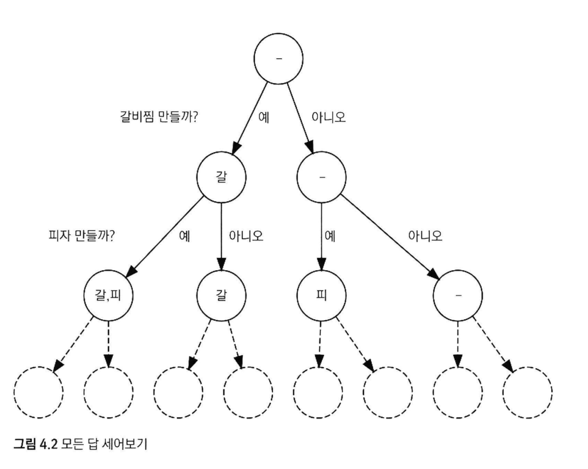

# 알고리즘의 시간복잡도 분석(종만북 4장)

1. ### 반복문이 지배한다.

    1. 알고리즘의 수행시간을 지배하는 것은 반복문이다. (서울에서 부산까지 가는데 시동 거는데 걸리는 시간 1~3분이 중요한 건 아니기 때문이다.)

2. ### 대표적인 수행시간의 형태

    1. #### 선형시간 알고리즘
      
        - 입력 크기에 대해 걸리는 시간이 직선이 되기에 선형시간 알고리즘으로 불린다.(`O(N)`)
    대표적인 예로 [계수정렬](https://bowbowbow.tistory.com/8) 등이 있다.
        
        ``` python
        # 원하는 값의 위치 탐색
        def search_index(arr: list, target: int) -> int:
            for idx in range(0, arr):
                if arr[idx] is target:
                    return idx
            return -1
        ```
        
    2. #### 선형시간 이하 알고리즘
    
    - ##### 성형 전 사진 찾기
    
        
    
    - ##### 이진 탐색
          
            - 정렬된 배열이 있을 경우 찾고자 하는 숫자가 있을 때 모든 수를 비교할 필요 없이 탐색이 가능한 `O(lgN)` 시간복잡도를 가진 알고리즘
                1. 배열의 중간 값을 선택한다.
                2. 중간 값과 찾고자 하는 값의 대소를 비교한다.
                3. 찾고자 하는 값이 없는 부분은 버린다.
                (찾고자 하는 값이 더 작을 경우 큰 부분을, 클 경우 작은 부분을 버린다.)
            4. 해당 부분을 하나의 배열로 생각하고 찾고자 하는 값이 나올때까지 1~3번을 반복한다.
            
            ```python
            # 원하는 값의 위치 탐색
            
            def binary_search(arr: list, target: int) -> int:
                first = 0
                last = len(arr) - 1
                mid = 0
                while(first <= last):
                    mid = int((first + last) / 2)
                    if arr[mid] > target:
                        last = mid - 1
                    elif arr[mid] < target:
                        first = mid + 1
                    else:
                        return mid
                return -1
            
            ```
    
3. #### 지수 시간 알고리즘
    
    1. ##### 다항 시간 알고리즘
          
            1. N, N^2, N^64 모두  다항 시간이지만..
            2. 이보다 더 오랜 시간이 걸리는 알고리즘이 있다.
        2. ##### 알러지가 심한 친구들([집합 덮개 문제](https://dudri63.github.io/2019/01/25/algo15/))
    
        
    
        1. 음식을 만드는 모든 경우의 수를 계산할 때마다. 모두 먹을 수 있는지 체크하기 때문에 시간복잡도는 (`O(N*M*2^M)`)
                1. M가지의 음식을 만들 경우와 만들지 않을 경우로 나눠 모든 경우의 수를 탐색한다. (`O(2^M)`)
                2. 경우의 수를 하나 만들 때마다 모두 먹을 수 있는지 체크한다. (`O(N*M)`)
                3. 모든 경우의 수를 체크한 후 모두 먹을 수 있는 경우에서 최소값을 구한다. (`O(N)`)
            2. 무식하게 풀어서 느린게 아니다 지수시간 알고리즘 보다 나은 다항시간 알고리즘이 존재하지 않는 문제도 아직 많다.
        3. ##### 소인수 분해의 수행 시간
          
            1. 입력으로 주어지는 숫자의 개수가 아니라 숫자의 크기에 따라 수행시간이 달라질수도 있다.
            2. 소인수 분해의 경우 주어진 숫자 `N이 1이 될 때까지` 나누기 때문에 크기 때문에 달라진다.