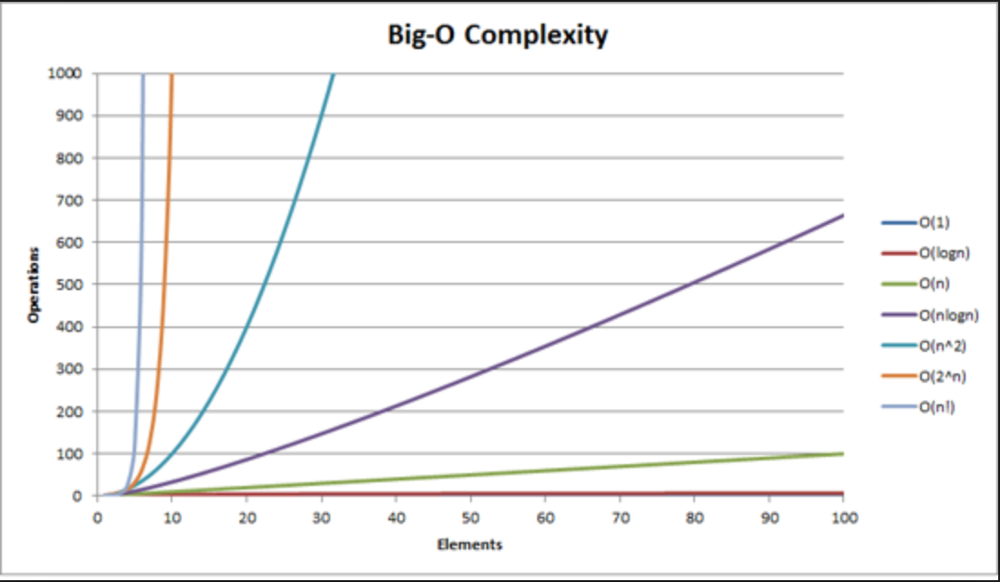

### 시간 복잡도

- *알고리즘이 실행되는 동안 수행하는 기본적인 연산의 수를 입력의 크기에 대한 함수로 표현한 것*
- 시간 복잡도가 높다 == 입력의 크기가 증가할 때 알고리즘의 수행 시간이 더 빠르게 증가한다.
- But, 시간 복잡도가 낮다고 해서 언제나 더 빠른건 아니다.
- ex) 10240 + 35*logN 과 2*N^2를 그래프로 비교했을 때, 전체적으로 봤을 때는 전자가 더 빠르나, N=10일 경우에는 2*N^2가 더 빠르다.

- 최선의 수행 시간
- 최악의 수행 시간
- 평균적인 경우의 수행 시간
- 점근적 시간 표기:
    - `O (빅 오)` - 보통 `Big-O` 표기법 사용
        - 점근적 상한선
        - 주어진 알고리즘이 아무리 좋지 않아도 비교하는 함수와 같거나 좋다.
    - `Ω (오메가)`
        - 점근적 하한선
        - 주어진 알고리즘이 아무리 좋아도 비교하는 함수보다 같거나 좋지 않다.
    - `Θ (세타)`
        - 점근적 상한과 하한의 교집합(최선과 최악의 평균적인 복잡도)
        - 주어진 알고리즘이 아무리 좋거나 좋지 않아도, 비교하는 함수의 범위 안에 있다.

### 수행 시간 어림짐작하기

- `O(N^3)` - 입력의 크기가 2560까지일 때 1초 안에 풀 수 있다.
- `O(N^2)` - 입력의 크기가 40960까지일 때 1초 안에 풀 수 있다.
- `O(NlogN)` - 입력의 크기가 2천만까지일 때 1초 안에 풀 수 있다.
- `O(N)` - 입력의 크기가 1억 6천만까지일 때 1초 안에 풀 수 있다.

 
### 주먹구구 법칙

- 프로그래밍 대회의 시간 제한은 시간 복잡도가 아닌 수행 시간이 기준
- 그러나 시간 복잡도를 알면 수행 시간을 짐작할 수있다.(짐작할 수 있어야 한다.)
- 입력의 크기를 시간 복잡도에 대입해서 얻은 반복문 수행 횟수에 대해, `1초당` 반복문 수행 횟수가 `1억(10^8)`을 넘어가면 시간 제한을 초과할 가능성이 있다.
- 주먹구구 법칙은 수많은 가정 위에 지어진 사상누각이기 때문에, 고려해야 할 사항이 몇가지 있다.
    - 시간 복잡도가 프로그램의 실제 수행 속도를 반영하지 못하는 경우
    - 반복문의 내부가 복잡한 경우
    - 메모리 사용 패턴이 복잡한 경우
    - 언어와 컴파일러의 차이
    - 구형 컴퓨터를 사용하는 경우

### 실제 적용해 보기

- 분할 정복
    - 전체 원소를 동일한 크기로 분할 후, 분할한 원소를 다시 병합하는 정렬 방식
    - 시간 복잡도(O)
        - 크기가 N인 배열을 반씩 분할 한다고 하면, N/2인 배열이 2개, 여기서 또 반씩 분할하면, N/4인 배열이 4개 ...로 진행된다.
        - 여기서, 분할 단계에서 분할되는 깊이가 logN에 비례한다. (분할 과정에서 매번 반씩 감소하므로, 반씩 줄어든다면 밑이 2인 logN 만큼 반복해야 크기가 1인 배열로 분할 가능하기 때문)
        - 합병 단계에서 최대 N번의 비교 연산을 하기 때문에 시간 복잡도는 최종적으로 `O(NlogN)`이 된다.

### P, NP, NP-완비

- `P 문제` 다항 시간 알고리즘이 존재하는 문제들의 집합
    - 다항 시간: `O(n^2)`, `O(n^3)`, ..., `O(n^k)`
    - ex) 정렬 문제
- `계산 복잡도 클래스` 같은 성질을 갖는 문제들을 모아놓은 집합
- 계산 복잡도 이론에서는 문제의 난이도를 비교하기 위해 `환산(reduction)`이라는 기법을 이용
    - `환산` 한 문제를 다른 문제로 바꿔서 푸는 기법
        - B라는 문제의 입력을 적절히 변형해 A의 입력으로 바꾸는 환산 알고리즘을 통해 빠르기를 비교하여 난이도 비교
- `NP 문제` 답이 주어졌을 때 이것이 정답인지를 다항 시간 내에 확인할 수 있는 문제
    - P 문제들은 NP 문제에도 포함된다.
    - 주어진 문제를 푸는 다항 알고리즘이 존재한다면, 이를 사용하여 문제를 처음부터 다시 푼 뒤 답을 비교하는 방식으로 정당성을 다항 시간에 확인할 수 있기 때문
